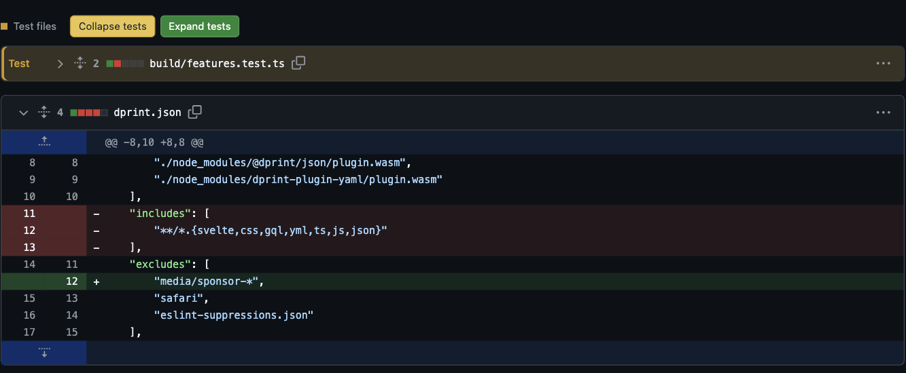
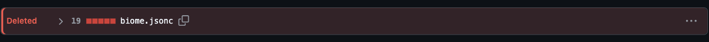
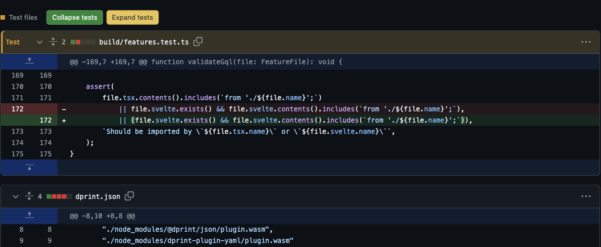

# Test on Prod 🗿

**Big PR. Less scrolling.**

A small Chrome extension that starts GitHub PR reviews with tests and deleted files collapsed. Ordinary source is left alone. Everything is still one click away.



## Why does this exist?

You open a PR to review a feature. First up: test setup. Then fixtures. Then snapshots. Then 300 removed lines from a file that no longer exists.

Now you're folding accordions instead of reading code.

**Test on Prod fixes the starting view.** Read the implementation first. Open the tests when you want to check the coverage. Inspect a deletion when you need the context.

No new dashboard. No repo configuration. No bot commenting on your PR. Just two buttons and file headers you can tell apart.

> The name is a joke. The tests still deserve a review.

## What happens to my files?

An example mixed PR:

| Changed file | What you see on arrival |
| --- | --- |
| `src/cart/total.ts` | Open, unchanged |
| `src/cart/total.test.ts` | **Test** — amber, collapsed |
| `src/components/Cart.cy.tsx` | **Test** — amber, collapsed |
| `tests/fixtures/cart.json` | **Test** — amber, collapsed |
| `src/cart/legacy-total.ts` *(deleted)* | **Deleted** — red, collapsed |
| `src/cart/legacy-total.spec.ts` *(deleted)* | **Test · Deleted** — red, collapsed |

Deleted files get their own label—not just a wall of red lines:



This uses GitHub's deletion status. A file that only removes a few lines is **not** treated as a deleted file.

## Two buttons. That's the UI.

- **Collapse tests** folds the test/support files.
- **Expand tests** opens them again.
- **Green:** action available. **Yellow:** already active, so no repeat click.
- Open one file manually? It stays open within that view. Mixed states make both bulk actions available again.
- Files loaded later follow your current choice.

GitHub's **Viewed** checkboxes stay untouched. Test buttons leave deleted non-test files alone. No click notifications.

<details>
<summary>See “Expand tests” in action</summary>

The tests come back. The source files don't move between open and closed.



</details>

## Install

1. [Download the ZIP](https://github.com/impolska742/test-on-prod/archive/refs/heads/main.zip) and extract it, or clone:
   ```sh
   git clone https://github.com/impolska742/test-on-prod.git
   ```
2. Open `chrome://extensions` and enable **Developer mode**.
3. Click **Load unpacked** and select the folder containing `manifest.json`.
4. Refresh a GitHub PR's `/changes` or `/files` page.

That's it. No `npm install`, build step, extension signup, or token.

**Updating:** pull/download the latest files, reload the extension, then refresh GitHub.

## Fits your JS / TS stack

| Language | Extensions |
| --- | --- |
| JavaScript | `.js`, `.jsx`, `.mjs`, `.cjs` |
| TypeScript | `.ts`, `.tsx`, `.mts`, `.cts` |

Common naming conventions used by **Jest, Vitest, Playwright, Cypress, Bun, Node.js, AVA, Mocha, and Jasmine** are covered.

<details>
<summary>Filename and folder examples</summary>

| Convention | Examples |
| --- | --- |
| Test / spec suffixes | `cart.test.ts`, `cart.spec.jsx`, `cart_test.js`, `cart_spec.mjs`, `cart-test.cjs` |
| Test entry points | `test.js`, `test-cart.ts`, `test_cart.mts` |
| Browser / E2E | `Cart.cy.tsx`, `checkout.e2e.ts`, `checkout.e2e-spec.ts` |
| Qualified tests | `cart.test.browser.tsx`, `cart.test.node.mjs` |
| Type tests / fixtures | `index.test-d.ts`, `index.type-test.ts`, `cart.fixture.ts`, `cart.snap` |
| Test folders | `test/`, `tests/`, `__tests__/`, `spec/`, `specs/`, `__specs__/`, `e2e/`, `testing/`, `test-d/` |
| Support folders | `test-utils/`, `test-helpers/`, `test-support/`, `fixtures/`, `__fixtures__/`, `__mocks__/`, `__snapshots__/` |
| Cypress folders | `cypress/e2e/`, `cypress/integration/`, `cypress/component/`, `cypress/support/`, `cypress/fixtures/`, `cypress/plugins/` |

Files inside recognized test/support folders are grouped regardless of extension. Markdown and `.txt` files stay visible unless deleted. Fully deleted files are recognized independently of language.

</details>

**The honest limits:** detection uses paths and GitHub's file-status markers, not source analysis or your test-runner config. Arbitrarily named tests can be missed. GitHub UI changes may require selector updates. GitHub Enterprise domains aren't supported yet.

## Your code stays on your machine

No analytics. No network requests from the extension. No storage, remote code, or GitHub credentials.

It reads filenames and file-status markers already on the page, then uses GitHub's own collapse controls. It runs on `github.com` so it can follow in-page navigation between PR tabs.

## Keep it small. Make it better.

Found a missed filename pattern or a GitHub UI change? [Open an issue](https://github.com/impolska742/test-on-prod/issues). Include a public reproduction or a filename example—not private code.

Want to contribute? Start with [CONTRIBUTING.md](CONTRIBUTING.md). Security issue? Use [private reporting](SECURITY.md), not a public issue.

[MIT licensed](LICENSE), including the original icon artwork. Independent project; not affiliated with GitHub.

<sub>Screenshots use public changes from refined-github PRs <a href="https://github.com/refined-github/refined-github/pull/10103/files">#10103</a> and <a href="https://github.com/refined-github/refined-github/pull/10104/files">#10104</a>. No private repository content.</sub>
